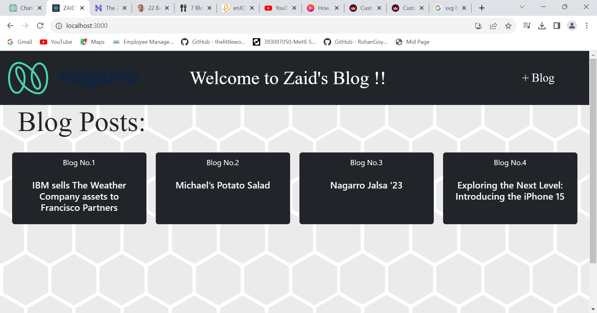
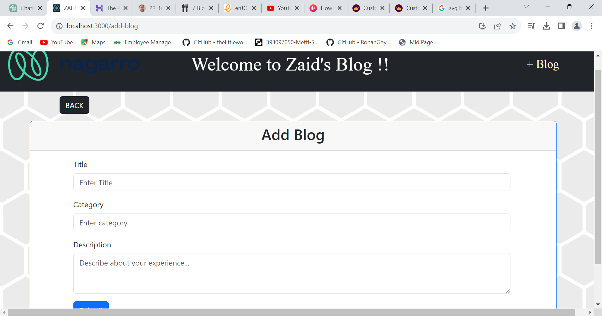
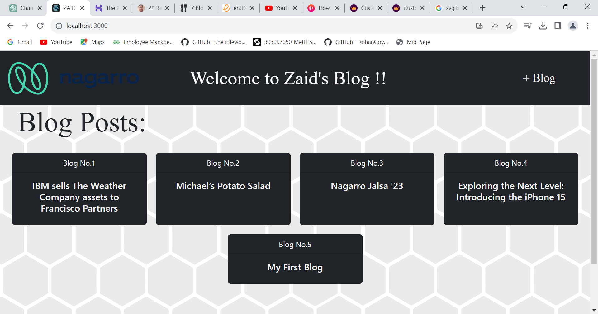
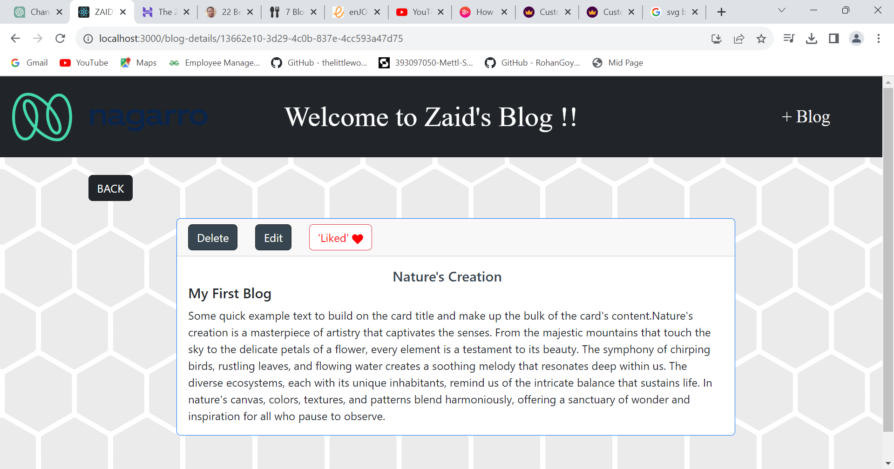
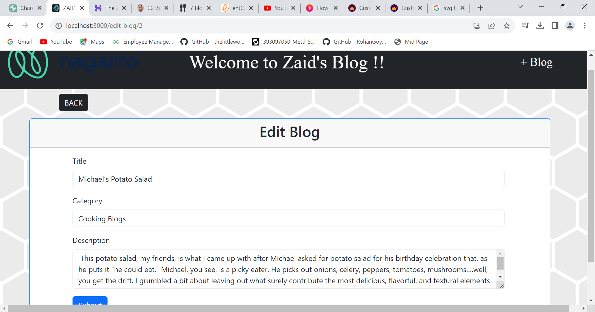

# Blog Post Web Application

 A “Blog post app” using React , ContextApi and Redux. 
 
 The list of blog posts is displayed by the application. 
 Users are allowed to create new posts, see the details of a post, edit it, remove it and can like or dislike that post. 
 
 Redux's toolkit and context API is used for state management. 
 The blog's state is controlled via Reduxux Toolkit and the like level of each blog is checked by Context API.

Following are the key functions:
• Show the list of blog post.
• View details of the blog post.
• Add a new blog post.
• Edit the blog post.
• Delete the blog post.
• Like the blog post.

## My APP Link:- 
[Zaid's Blog Site](http://zaidullah099.surge.sh/)

## Setup Guide

### Backend

Step1: Open the Project in Visual Studio Code

Step2: Open Terminal in Visual Studio Code

Step3: Run the command "npm install"

Step4: Run the App using comman "npm start"

### Frontend

Open http://localhost:3000 to view it in your browser.

## Product Images

## Screenshots
### Home Page

### Add Blog Page

### Add Blog Fields Filled Page

### Blog Added on Home Page View

### Full Blog Content View

### Blog Liked

### Edit Blog Page
